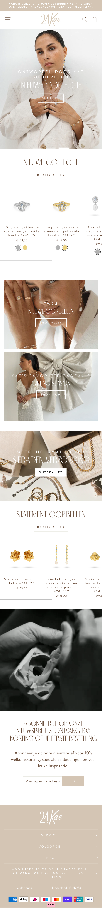
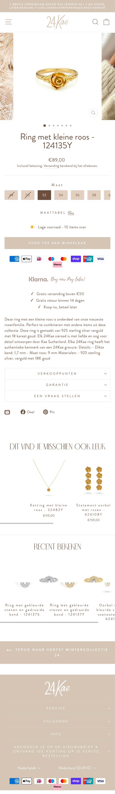
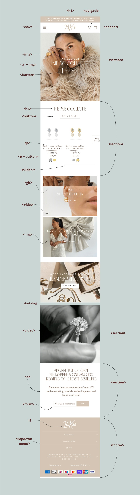
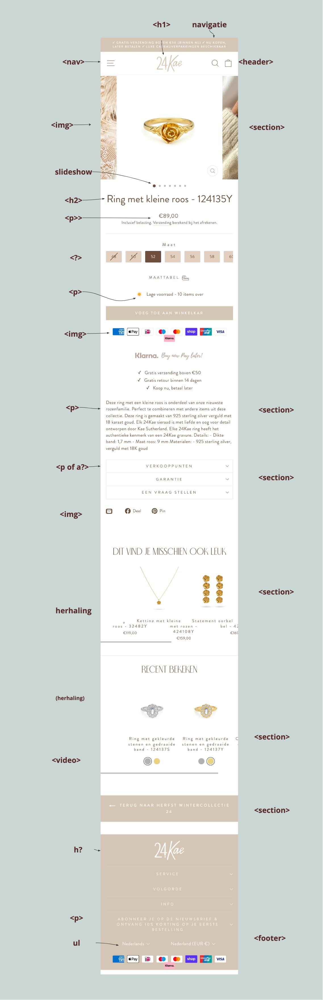
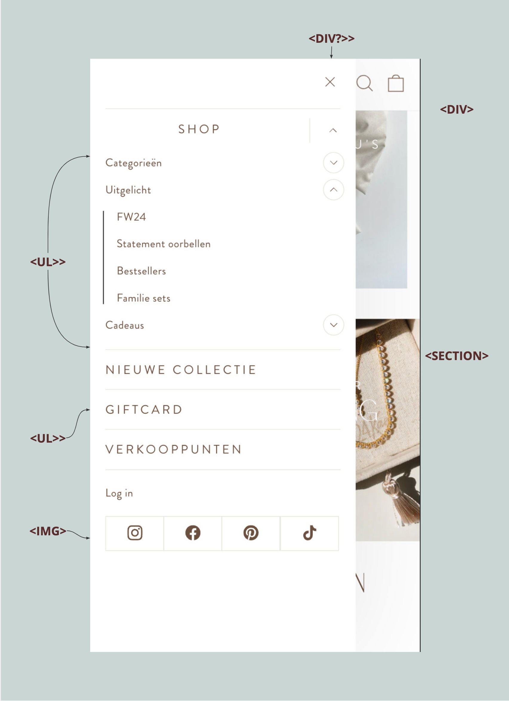
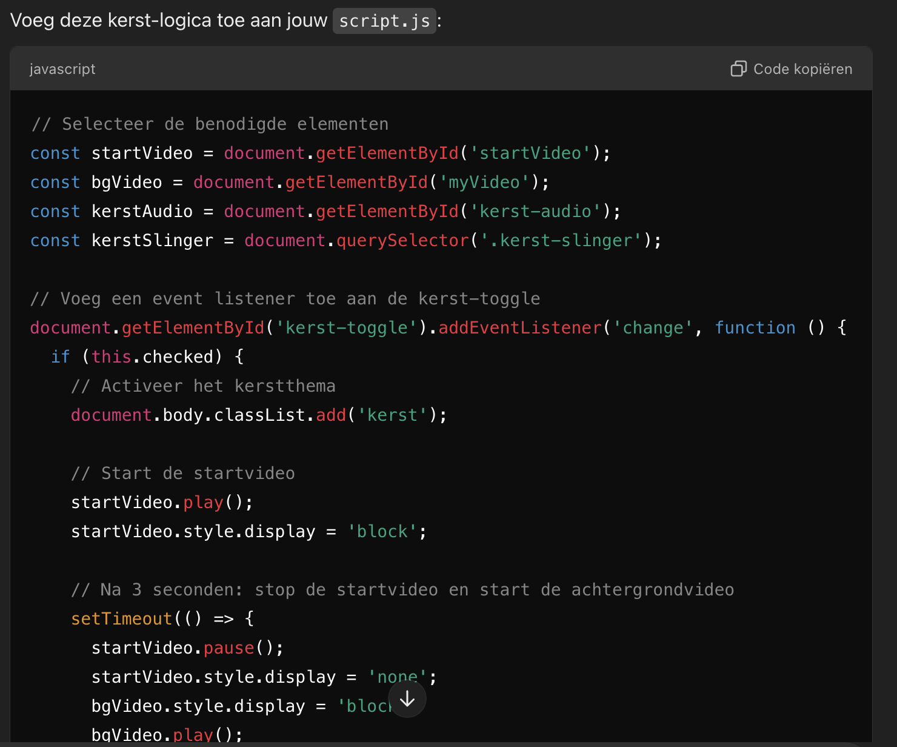

# Procesverslag
Markdown is een simpele manier om HTML te schrijven.  
Markdown cheat cheet: [Hulp bij het schrijven van Markdown](https://github.com/adam-p/markdown-here/wiki/Markdown-Cheatsheet).

Nb. De standaardstructuur en de spartaanse opmaak van de README.md zijn helemaal prima. Het gaat om de inhoud van je procesverslag. Besteedt de tijd voor pracht en praal aan je website.

Nb. Door *open* toe te voegen aan een *details* element kun je deze standaard open zetten. Fijn om dat steeds voor de relevante stuk(ken) te doen.

## Jij

  
uitwerken voor kick-off werkgroep

  ### Auteur:
  Hanna Berhane

  #### Je startniveau:
  Blauw

  #### Je focus:
  Responsive ( nu dus surface)
 

## Je website

  
 sieraden page

  ### Je opdracht:
 24kae : https://www.24-kae.com/?gad_source=1&gclid=EAIaIQobChMIgJOorMfpiQMVKaODBx31KTgfEAAYASAAEgL1dPD_BwE

  #### Screenshot(s) van de eerste pagina (small screen): 
  1 : overzicht beginpagina met slide shows, gif en een video

  

  #### Screenshot(s) van de tweede pagina (small screen):
  uitgekozen sieraad : overzicht, prijs en alle info
  

 

## Toegankelijkheidstest 1/2 (week 1)

  
uitwerken na test in 2e werkgroep

  ### Bevindingen
  Lijst met je bevindingen die in de test naar voren kwamen:
  - De screenreader leest alle tekst op mijn website, maar soms ook dingen die ik niet had verwacht. Bijvoorbeeld sieraden afbeeldingen zonder een alt-attribuut worden als "onbekend" voorgelezen. Hierdoor merkte ik dat het belangrijk is om alleen nuttige teksten of beschrijvingen te laten lezen.
  
  - tab toets werkt vaak niet overal
  - toegangkelijkheid stopt af en toe

  - Mijn site heeft helemaal geen ARIA-labels, waardoor gebruikers met een screenreader niet weten wat bepaalde knoppen of onderdelen doen. Een voorbeeld is de zoekbalk, waar ik geen aria-label had toegevoegd om aan te geven dat het een zoekveld is.

     

## Breakdownschets (week 1)

  
uitwerken na afloop 3e werkgroep

  ### de hele pagina: 
  

  ### dynamisch deel (bijv menu): 
  

  ### wellicht nog een dynamisch deel (bijv filter): 
  

## Voortgang 1 (week 2)

  
uitwerken voor 1e voortgang

  ### Stand van zaken

 wat ging goed : 
  . basis html nog goed begrijpen
  . een leuke site uitgekozen

 Wat ging minder : 

  . meer oefenen met coderen
  . proberen zo min mogelijk div te gebruiken

  ### Agenda voor meeting
  samen met je groepje opstellen

  | student 1      | student 2          | student 3    | student 4        |
  | ---            | ---                | ---          | ---              |
  | dit bespreken  | en dit             | en ik dit    | en dan ik dat    |
  | en dat ook nog | dit als er tijd is | nog een punt | dit wil ik zeker |
  | ...            | ...                | ...          | ...              |

  ### Verslag van meeting
  hier na afloop snel de uitkomsten van de meeting vastleggen

  - Fijne gesprek met de studentassisenten en groepje. Uitleg was duidelijk en je weet wat er verwacht word van je.
  - Het was fijn om code te krijgen voor een slideshow, ik snap het nu wat beter
  - 
  - ...

## Voortgang 2 (week 3)

  
uitwerken voor 2e voortgang

  ### Stand van zaken
  code begrijpen gaat goed, toepassen alleen niet.
  Bezig geweest met slide show, positioneren nog mee oefenen.
  
  Ik merk dat ik er nogsteeds in moet code, ik geef het snel op. Door de korte periode krijg ik wel beetje stress van, maar so far so good.

  Ik ben nu bezig met mijn hamburgermenu en alles juist positioneren. (hamburgermenu werkt) Ik oefen veel met flexbox en de opdrachten.

  kleuren kloppen nu ook.

  vraag : hoe krijg ik de header p helemaal boven aan en vast en responsive.

 

  ### Verslag van meeting
  hier na afloop snel de uitkomsten van de meeting vastleggen

  - Nogsteeds veel moeite maar goed op weg.
  - FB was fijn, ik weet nu meer info over flexbx en image over teks
- ...

## Toegankelijkheidstest 2/2 (week 4)

  
uitwerken na test in 9e werkgroep

  ### Bevindingen

                                  -Toegankelijkheidstest Screenreader-

Tijdens het testen van mijn website met een screenreader heb ik een aantal sterke punten en verbeterpunten ontdekt. 
Hieronder volgt een overzicht van mijn bevindingen.

Sterke punten van mijn code:
* Aria-labels voor knoppen en navigatie:

Ik heb duidelijke aria-labels toegevoegd aan interactieve elementen zoals knoppen en menu's, bijvoorbeeld aria-label="Zoeken" en aria-label="Menu openen". Hierdoor begrijpt de screenreader-gebruiker de functionaliteit van deze elementen beter. 

* Gebruik van semantische HTML:

Ik maak gebruik van semantische HTML-tags zoals <header>, <main>, <section>, <nav>, en <footer>. Dit zorgt ervoor dat de structuur van mijn pagina goed wordt weergegeven voor screenreader-gebruikers. 

* Alt-teksten voor afbeeldingen:

Elke afbeelding heeft een betekenisvolle alt-tekst, zoals alt="Ring met gekleurde stenen". Hierdoor kunnen gebruikers die geen afbeeldingen zien, toch begrijpen wat er wordt weergegeven. 

* Formulieren en aria-labels:

De nieuwsbriefsectie is goed toegankelijk gemaakt met aria-label="Nieuwsbrief inschrijving". Dit maakt duidelijk wat het doel is van het formulier. 

* Focusstijlen:

Ik gebruik standaard focusstijlen voor knoppen en links, waardoor navigeren met het toetsenbord eenvoudig blijft. 

                                          -Verbeterpunten en oplossingen-
* Logische volgorde van headers:

Probleem: Tijdens het testen merkte ik op dat sommige headers niet logisch genest zijn. Bijvoorbeeld, in de sieraden-verzorging-sectie gebruik ik een <h2> en <h3>, wat goed is. Maar elders in mijn code ontbreekt soms een duidelijke hiërarchie.

Oplossing: Ik moet controleren of alle headers netjes in volgorde staan: <h1> > <h2> > <h3>.

* Focusvolgorde bij sliders:

Probleem: Bij het testen van de sliders merkte ik dat de focus niet automatisch naar het volgende item beweegt. Hierdoor wordt het moeilijker om door de producten te navigeren met een screenreader.

Oplossing: weet ik nog niet. 

* Aria-live voor dynamische content:

Probleem: Tijdens de test ontdekte ik dat wijzigingen in dynamische secties, zoals sliders of de donkere modus, niet automatisch worden doorgegeven aan de screenreader.

Oplossing: Ik gebruik aria-live="polite" of aria-live="assertive" om belangrijke wijzigingen aan te kondigen. ( bron chatgpt, zsm uitesten of dit werkt en vragen docent of dit mag)

* Feedback bij donkere modus:

Probleem: Toen ik de donkere modus inschakelde, merkte ik dat de wijziging visueel zichtbaar is, maar dat er geen auditieve feedback of duidelijke statusmelding is voor screenreaders.

Oplossing : geen idee, ik denk plaatjes mee veranderen naar dark mode

                                            -Conclusie-

Na mijn test heb ik vastgesteld dat mijn code grotendeels goed werkt met screenreaders. Vooral de semantische structuur en de duidelijke aria-labels dragen bij aan een toegankelijke ervaring. maar, ik heb ook een paar punten  die ik kan verbeteren:

* De headers moeten logischer worden genest.
* Sliders hebben verbeterd focusbeheer nodig.
*  wijzigingen zoals Dark/light mode moeten beter worden aangekondigd.
* Het hamburger menu kan toegankelijker worden gemaakt.

## Voortgang 3 (week 4)

  
uitwerken voor 3e voortgang

  ### Stand van zaken
  Wat ging goed: mobile format werkt + slideshow. 

  Wat ging minder : responsive werkt nogsteeds niet. ik heb erg veel moeite hiermee gehad en heb besloten om nu dus voor surface plane te gaan! 

   ### vragen :

   * responsive

  ### Agenda voor meeting
  samen met je groepje opstellen

  | student 1      | student 2          | student 3    | student 4        |
  | ---            | ---                | ---          | ---              |
  | dit bespreken  | en dit             | en ik dit    | en dan ik dat    |
  | en dat ook nog | dit als er tijd is | nog een punt | dit wil ik zeker |
  | ...            | ...                | ...          | ...              |

  ### Verslag van meeting
  hier na afloop snel de uitkomsten van de meeting vastleggen

  - Ik moet nog veel doen voor een voldoende, vanwege responsive loop ik erg achter.
  - Code moet semantisch, onnodige css
  - Ik twijfel nu om voor surface plane te gaan, want media queries lukken niet echt. wel voor mobiele format
  - ...

## Eindgesprek (week 5)

  
uitwerken voor eindgesprek

  ### Je uitkomst - karakteristiek screenshots:
  

  ### Dit ging goed/Heb ik geleerd: 
  Mijn ervaring met dit project

Ik vond dit project wel oké gaan. In het begin was ik heel geïnteresseerd, want coderen is echt leuk als je het begrijpt. De opzet van mijn site ging goed, omdat ik dat nog wist van vorig jaar. Het voelde fijn om dat snel op te pakken.

Wat goed ging:

Wat ik supertof vind, is dat mijn slideshow op de homepage nu helemaal werkt! Ik heb er dagen aan gewerkt, maar hij schuift nu automatisch elke 3 seconden. Dat voelde echt als een overwinning.
Ook ben ik blij dat mijn kerstthema werkt. Het was leuk om dat interactief te maken met video’s, geluid en een switch. ondanks dat ik laatste moment ben geswitcht naar surface.

Wat ik geleerd heb:

JavaScript vind ik nog steeds lastig, maar het is wel gelukt. Vooral met de functies voor de slider heb ik veel geoefend en geleerd hoe je logica opbouwt.
Ik heb weer meer geleerd over Flexbox, wat eerst altijd een uitdaging was. Gelukkig werkt mijn layout nu goed op mobiele en iPad-schermen, daar ben ik tevreden over.

Het gebruik van een screenreader was nieuw voor mij. Ik vond het mooi om te leren hoe je met ARIA-labels een website toegankelijker maakt voor mensen met een beperking. Dat voelt echt als een stukje inclusiviteit dat belangrijk is.

Mijn ervaring met feedback:

De feedback en lessen waren echt fijn. Tips zoals het toevoegen van hover-effecten en het verbeteren van mijn productpagina’s hebben mijn website veel netter gemaakt.

Waar ik trots op ben:

Mijn slideshow en dark/lightmode toggleswitch is  mijn hoogtepunt, omdat ik daar veel tijd in heb gestopt en het uiteindelijk werkte.

  ### Dit was lastig/Is niet gelukt:
  Korte omschrijving met plaatjes

  

Het bouwen van een site in 4 weken vond ik echt moeilijk. Ik had moeite om in de “flow” te komen, en als je eenmaal vastloopt, is het lastig om weer door te gaan. Het voelde alsof er niet genoeg tijd was om alles uit te proberen.

Responsive design:

Responsiveness vond ik lastig, vooral voor grotere schermen zoals desktops. Op iPads werkt het gelukkig wel goed, maar ik had gehoopt dat alles overal netjes zou zijn. Foto’s en layouts kregen gewoon niet de juiste verhoudingen, hoe vaak ik het ook probeerde.

Screenreaders en ARIA:

In het begin snapte ik niks van screenreaders en ARIA-labels. Het waren veel nieuwe termen, en het duurde even voordat ik doorhad hoe alles werkt. Achteraf gezien vond ik het wel mooi om hier meer over te leren.

Hamburger-menu:

Mijn hamburger-menu was echt een frustratiepunt. Ik heb er dagen aan gewerkt, maar het is uiteindelijk niet gelukt om dropdowns werkend te krijgen. Omdat ik er zoveel tijd in heb gestopt, besloot ik het menu maar zo te laten en door te gaan met andere dingen.

Semantisch werken:

Het gebruik van semantische HTML vond ik lastig, omdat ik vaak een andere logica in mijn hoofd heb. Dit zorgde soms voor verwarring bij anderen en studentassistenten. Ik heb dit uiteindelijk verbeterd en nu is mijn site netjes gestructureerd, maar het was een uitdaging.

Consistentie:

Het was moeilijk om alles consistent te houden op mijn pagina. Sommige onderdelen passen nu niet helemaal bij elkaar, zoals de footer. Het voelt een beetje rommelig, en ik weet dat dit mooier kan.

Wat ik zou willen verbeteren:

Als ik meer tijd had, zou ik:
Mijn hamburger-menu nog een kans geven.
De footer mooier maken en beter laten aansluiten bij de rest.
Meer aandacht besteden aan responsiveness en zorgen dat mijn site ook op desktop goed werkt.

                    Mijn switch van responsive naar surface plane
Tijdens het project merkte ik dat responsiveness voor grotere schermen, zoals desktops, niet helemaal wilde lukken. Ik kon mijn layout wel goed krijgen tot een iPad-scherm, maar op desktop viel alles een beetje uit elkaar. Dit zorgde voor veel frustratie, want ik kreeg de afmetingen en afbeeldingen niet mooi op één lijn.

Uiteindelijk besloot ik om mijn focus te verleggen naar het verbeteren van de surface plane van mijn website. Het was een moeilijke keuze maar heb het toch gedaan en hoop dat het voldoende is.

dit heb ik toegevoegd : 

Een werkende dark/light mode toggle toegevoegd.

Video/geluid

Een kerstthema

Toegankelijkheid verbeterd met ARIA-labels en screenreader-tests.

Een  CSS-animatie toegevoegd die ringen laat draaien.

## Bronnenlijst

  
continu bijhouden terwijl je werkt

  Nb. Wees specifiek ('css-tricks' als bron is bijv. niet specifiek genoeg). 
  Nb. ChatGpT en andere AI horen er ook bij.
  Nb. Vermeld de bronnen ook in je code.

  1. bron 1 : carrousel thomas : https://codepen.io/shooft/pen/yLKjzWa
  2. bron 2 : w3schools : https://www.w3schools.com/howto/howto_css_image_text.asp
  3. bron 3 : flexbox froggy : https://flexboxfroggy.com/#nl
  4. bron 4 : search bar : https://www.w3schools.com/howto/howto_css_searchbar.asp
  5. bron 5 : cart update animatie : https://codepen.io/shooft/pen/MWMGLGV
  6. bron 6: toggle menu : https://codepen.io/LayalaDev/pen/RwEYEPZ 
  7. bron 7 : dark color scheme : https://developer.mozilla.org/en-US/docs/Web/CSS/@media/prefers-color-scheme 
  8. bron 8: background video : https://www.canva.com/search?q=christmas%20snow%20video
  9. bron 9. behulp van chatgpt, kerst thema. 

